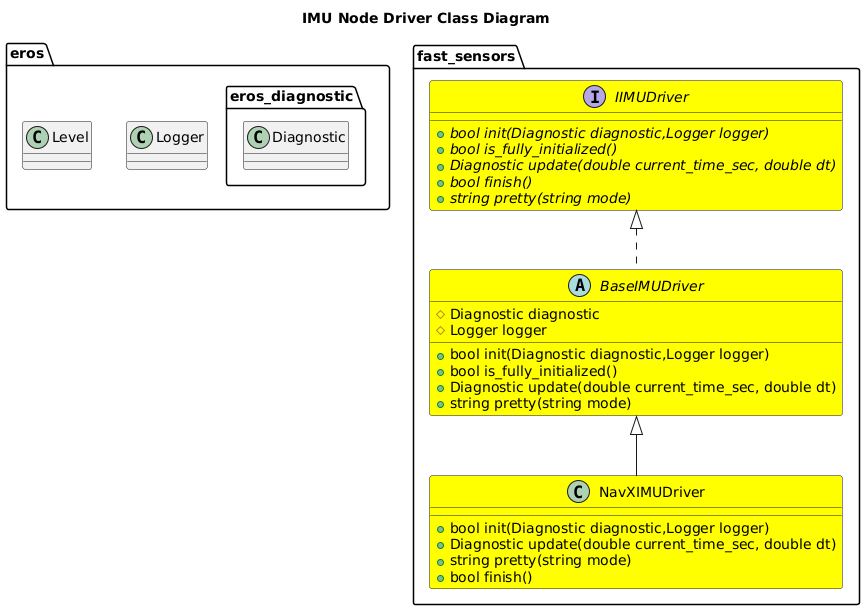
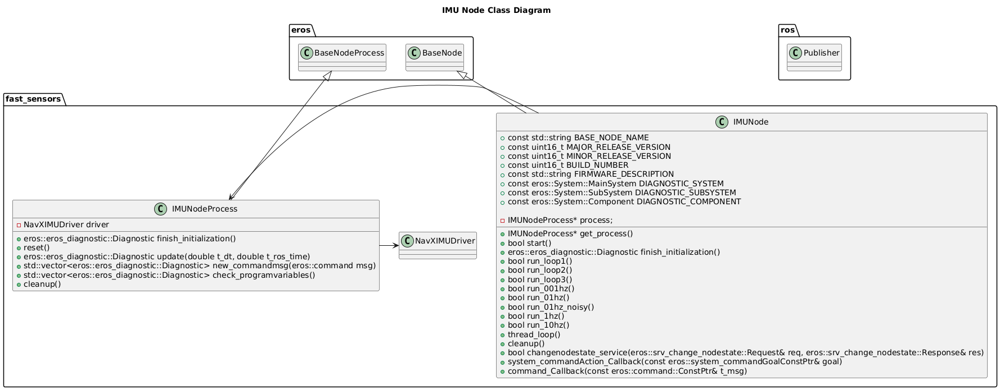
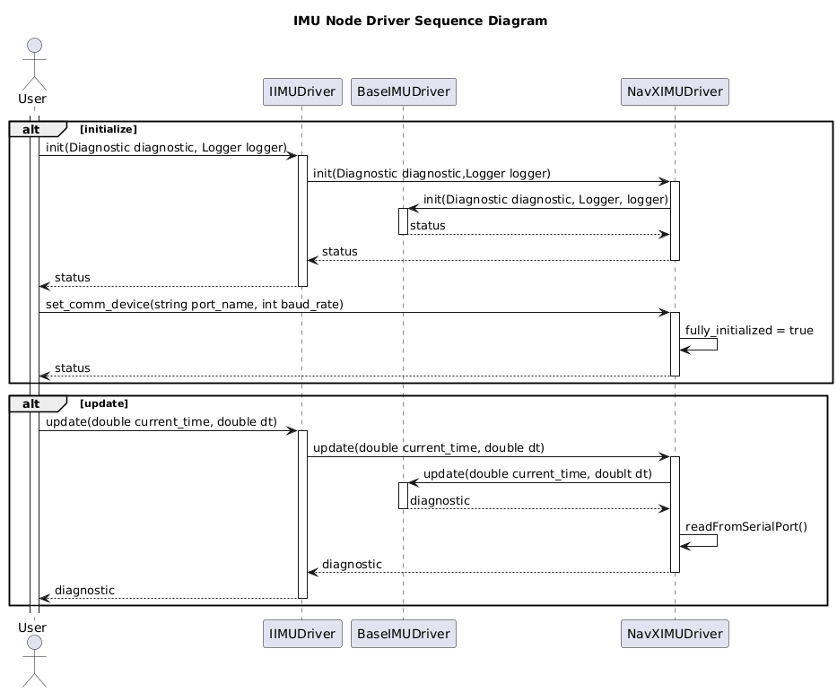
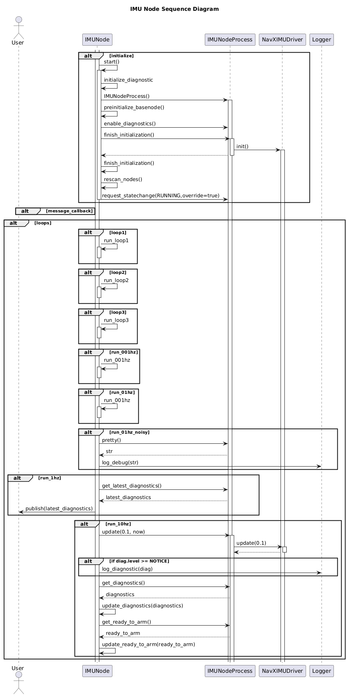

# IMU
| Status | IMU Sensor |
| --- | --- |
| DRAFT | [NavXIMU](NavXIMU/NavXIMU.md) |

## Setup
```bash
sudo apt install ros-noetic-rviz-imu-plugin
```

## Visualization
```bash
rosrun rviz rviz -d src/fast_sensors/doc/Sensors/IMU/rviz_imu.rviz
```

## Software Design


### Class Diagrams



### Sequence Diagrams



